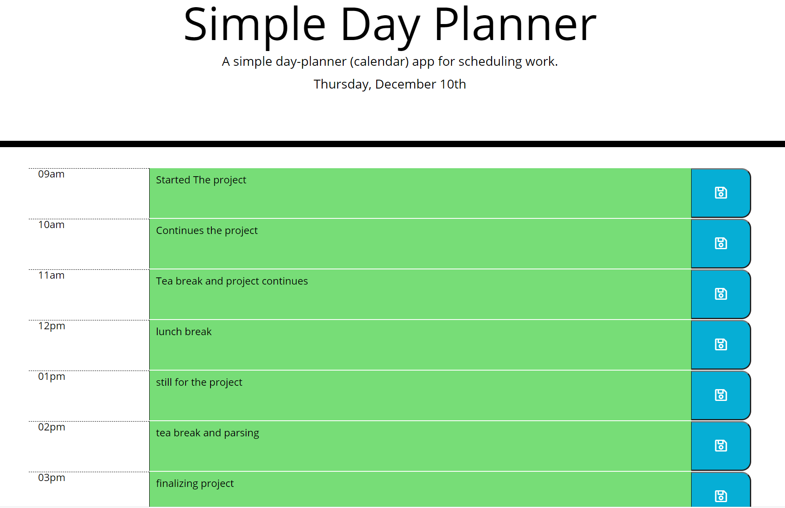
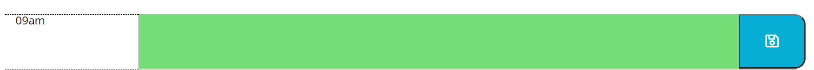

# simple-day-planner
Simple day planner is built using jQuery and the moment.js library and using localStorage.

This has been deployed to GitHub. To get this web app ( or project) up and running, one can follow the link(deployment).one can also download the file to use as template.
 
* [GitHub Repository]: (https://github.com/citenaresh/Simple-Day-Planner/)
* [Deployed GitHub IO](https://citenaresh.github.io/blah-blah-blah/index.html): https://citenaresh.github.io/Simple-Day-Planner/index.html

The screenshot of the Day Planner :

### project's Summary
This is a basic day planner app that loops through the hours of 9am - 5pm for a specific date, that is current day (or today). The app uses moment.js to handle time. The app allows the user to enter and save text into any description field that has a class of future. The data will be saved to the localStorage of the browser. The past hours are highlighted gray, the current hour red, and future hours green.

* The user will be presented with 9 rows of day planner with time slot already fixed(in first column), then in the second column, which is a text area, one can enter the note 

then in the third column, the user can click on the  save button to save the data to the local storage

### The Psuedo Code for the Project: 

* First a variable is declared to store and loop through the time slots     
* Then moments.js is used to grab the data for the header date.
* he rows for the Day planner body is created using JQuery's methods(this includes time fields, planner data or description and a save button)
* And we create a function to sets any existing localStorage data to the view if it exists.
* When save button is clicked, a function is called which will saves data to localstorage

### How To Execute the Files:
> The files should be Open in browser.

### Features: 
* HTML Page
    * Index.html 
        The main UI design
* CSS file
    * Styles.css
         for the style of the page (index.html)
* Javascript file
         script.js for loading the day planner body and saving and displaying from localstorage

## Authors

* **Naresh Raj Poudel** - [Git Hub Profile](https://github.com/citenaresh): https://github.com/citenaresh

## Acknowledgments

* Great gratitude to Luca ([https://github.com/duvet86](https://github.com/duvet86)), Sam ([https://github.com/sam-ngu](https://github.com/sam-ngu)) and Renata from the UWA Bootcamp for their enormous help.
